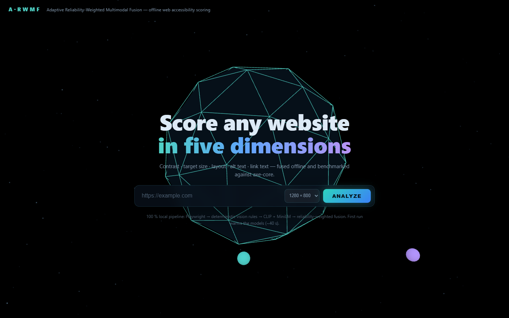
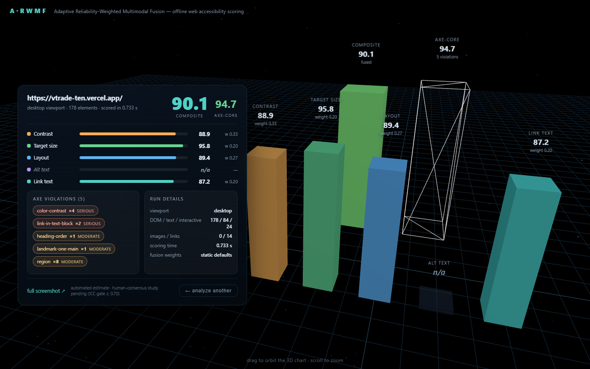

# A-RWMF — Offline Web Accessibility Scoring

**Adaptive Reliability-Weighted Multimodal Fusion for Offline Web Accessibility Scoring,
Validated Against Multi-Rater Human Consensus**

BCSE397J Special Project — Anivesh Gupta (23BCE0291), VIT Vellore.

---

## What is this?

A-RWMF takes a **URL** and returns a single **0–100 accessibility score** by fusing five
per-dimension measurements computed entirely on your machine:

| Dimension | What it measures | How |
|---|---|---|
| **D1 Contrast** | text/background contrast ratios | WCAG 1.4.3/1.4.6/1.4.11 math on captured pixels |
| **D2 Target size** | interactive element sizes | WCAG 2.5.8 (≥ 24 px) on DOM hit rects |
| **D3 Layout** | visual clutter & structural landmarks | edge density (OpenCV) + `<main>`/skip-link/nav checks |
| **D4 Alt text** | whether alt text matches the image | CLIP ViT-B/32 image–text agreement (local) |
| **D5 Link text** | whether link text describes its target | MiniLM embeddings vs surrounding context (local) |

Classical computer vision is fused with two small local models into one composite,
weighted by **inter-rater reliability** and validated against a **5-rater human
consensus study** with ICC statistics — while axe-core (the rule-checker baseline)
runs on every page for comparison.

**Why not just use axe-core?** Rule checkers saturate: well-built pages all score
≥ 99, so they can't rank quality *between* good pages (the ceiling effect). On an
8-page smoke benchmark A-RWMF spread 50–91 while axe-core clustered 76.9–100 —
yet both agreed on the worst page. This project is about that discrimination,
grounded in human judgement rather than asserted.

**Everything runs offline after the initial model download. No cloud API calls, ever.**

---

## Demo

**Hosted demo** → <https://arwmf-web-accessibility-scoring.vercel.app> — the same 3D
interface in your browser, replaying **real recorded results** from the 8-page benchmark
run (clearly badged *pre-recorded*; live scoring always runs locally).

| Landing (3D scene) | Results (orbitable 3D chart) |
|---|---|
|  |  |

Click a recorded-page chip (or type a URL) → watch the analysis phases → orbit the
five-dimension bar chart against the axe-core ghost pillar (drag to rotate, scroll to zoom).

---

## Architecture

```
                        URL input:  CLI  ·  batch manifest  ·  Web UI
                                         │
   ┌─────────────────────────────────────▼──────────────────────────────────────┐
   │  ① CAPTURE — Playwright (headless Chrome/Edge)                             │
   │     capture.png (full-page screenshot)  +  capture.json                    │
   │     (text / interactive / images / links  + rects, styles, structure)      │
   └─────────────────────────────────────┬──────────────────────────────────────┘
                                         ▼
   ┌──────────────── ② FIVE DIMENSION SCORERS — all local, no network ─────────────────────┐
   │                                                                                        │
   │   D1 CONTRAST        D2 TARGET SIZE      D3 LAYOUT       D4 ALT TEXT    D5 LINK TEXT  │
   │   WCAG ratio math    ≥24 px check        edge density    CLIP ViT-B/32  MiniLM-L6     │
   │   on captured DOM    on hit rects        + landmarks     img↔alt match  ctx↔link match│
   │      vision/            vision/            vision/          nlp/            nlp/       │
   └────────────────────────────────────┬───────────────────────────────────────────────────┘
                                        ▼
   ┌───────────────────────────────────────────────────────────────────────────────────────┐
   │  ③ RELIABILITY-WEIGHTED FUSION — fusion.py                                           │
   │     w_d ∝ max(ICC_d, 0) + λ  (shrinkage λ = 0.1), renormalised over the dimensions   │
   │     that apply to the page  →  composite 0–100                                       │
   │     (static global weights now; page-context buckets = A-RWMF, docs/05)              │
   └────────────────────────────────────┬──────────────────────────────────────────────────┘
                                        ▼
   ┌──────────────────────────────┴───────────────────────────────┐
   │  ④ BASELINE + VALIDATION                                     │
   │   axe-core 4.13                  stats/ (ICC, bootstrap,     │
   │   frozen penalty → 0–100          median consensus, Spearman │
   │   (same page, same run)          ρ vs human ratings → RQ3)   │
   └───────────────┬───────────────────────────────┬──────────────┘
                   ▼                               ▼
   ┌────────────────────────┐        ┌──────────────────────────────────────┐
   │  OUTPUTS: CLI / CSV    │        │  Web UI — Flask job queue + Three.js │
   │  scores.json           │        │  http://127.0.0.1:5000               │
   │  scores_system.csv     │        │  3D phases → orbitable result chart  │
   │  report (ρ, MAE, ICC)  │        └──────────────────────────────────────┘
   └────────────────────────┘
```

---

## Tech stack

| Layer | Technology |
|---|---|
| Language | **Python 3.10+** (package `arwmf`, `src/` layout) |
| Page capture | **Playwright** — headless Chrome/Edge (or bundled Chromium) |
| Vision / geometry | **OpenCV · Pillow · NumPy · SciPy** — deterministic WCAG formulas |
| Multimodal models | **PyTorch** + HuggingFace **CLIP ViT-B/32** (alt text), **all-MiniLM-L6-v2** (link text) — cached locally, offline |
| Baseline | **axe-core 4.13** (npm), injected via `Runtime.evaluate` to bypass strict CSP |
| Statistics | **ICC(A,1)/(A,k)**, bootstrap CIs, median consensus, Spearman ρ (pandas) |
| Web backend | **Flask** — REST API + single-worker job queue over the pipeline |
| Web frontend | **Three.js r160** (vendored locally — no CDN), vanilla JS/CSS, glassmorphism |
| Tests | **pytest** — 47 tests (stats validated against the published pingouin wine example) |

---

## Quick start

```powershell
# 1. setup (once)
git clone <repo-url>
cd ARWMF-Web-Accessibility-Scoring
pip install -e .[dev,web]          # core + tests + web UI (Flask)
npm install                        # axe-core (baseline) + three (3D UI)

# 2. pick a browser
$env:A11Y_BROWSER_CHANNEL = "chrome"      # use installed Chrome/Edge  (this project's default)
#   or download Playwright's own browser:
#   python -m playwright install chromium

# 3. run the tests
python -m pytest tests -q                 # 47 passed

# 4. run EVERYTHING: tests → batch benchmark (capture+score+axe) → report
scripts\run_all.cmd

# 5. the 3D web UI
python webapp/server.py                   # → http://127.0.0.1:5000
```

> **First run** downloads CLIP ViT-B/32 (~600 MB) and MiniLM-L6 (~90 MB) to the
> HuggingFace cache and warms them (~40 s). Everything after that is fully offline;
> small pages score in ~1 s (heavy full-page vision takes longer).

### Hosted demo (static site, Vercel)

The live pipeline (Playwright + PyTorch + a job queue) can't run serverless, so the repo
ships a **static demo** in `site/`: the identical 3D UI replaying the real recorded
benchmark results client-side — no backend, no build step.

```powershell
python scripts/build_demo_site.py                  # rebuild site/data + assets from recorded runs
python -m http.server 8090 --directory site        # preview locally → http://127.0.0.1:8090
```

To publish: **Vercel → Add New → Project → import this repo** — `vercel.json` already
points at `site/` (blank build/install commands). Every push to `main` redeploys.
Live scoring stays local: `python webapp/server.py`.

### Individual commands

```powershell
# capture a page (screenshot + element records)
python -m arwmf capture https://example.com --out page_captures/example

# score it  (--no-clip / --no-embeddings for cheap vision+heuristics-only runs)
python -m arwmf score page_captures/example -o scores.json

# axe-core baseline
python -m arwmf axe https://example.com

# ICC analysis over the human ratings CSV
python -m arwmf icc human_study/ratings.csv --dimension overall --bootstrap 10000 `
    --consensus human_study/consensus.csv

# batch benchmark over a page manifest
python scripts/run_benchmark_captures.py --manifest human_study/pages-manifest.csv `
    --out page_captures/run1

# correlation + compute report (system vs axe vs human consensus — RQ3)
python scripts/report_correlation_and_compute.py --ratings human_study/ratings.csv `
    --system page_captures/run1/scores_system.csv --axe page_captures/run1/scores_axe.csv
```

---

## Repository layout

```
PROPOSAL.md                              — project proposal (A-RWMF, revised)
README.md                                — this file
docs/
  01-rater-study-protocol.md             — pre-registered multi-rater study design
  02-accessibility-scoring-specification.md — frozen scoring formulas (D1–D5 + axe)
  03-rater-training-and-calibration-guide.md — 30-min rater walkthrough + anchors
  04-protocol-deviation-log.md           — where post-freeze changes are recorded
  05-rwmf-arwmf-fusion-methodology.md    — RWMF/A-RWMF fitting spec + pseudocode
  screenshots/                           — web UI demo screenshots
src/arwmf/
  capture.py                             — Playwright: screenshots + element records
  vision/                                — D1 contrast, D2 target size, D3 layout
  nlp/                                   — D4 CLIP alt-text, D5 link-text
  fusion.py                              — weighted composite, renormalisation
  stats/                                 — ICC(A,1)/(A,k), median consensus, bootstrap
  baselines/axe.py                       — axe-core baseline, frozen 0–100 mapping
  pipeline.py                            — capture → dimensions → composite
  cli.py                                 — command-line entry point
tests/                                   — 47 tests (fixtures + reference datasets inside)
human_study/
  templates/                             — ratings + manifest schemas
  calibration_pages/                     — 3 calibration pages for rater training
  pages-manifest.csv                     — current benchmark page set
scripts/
  run_all.cmd                            — ONE command: tests → batch → report
  run_benchmark_captures.py              — batch capture + score + axe over manifest
  report_correlation_and_compute.py      — ICC / ρ / MAE / compute report (RQ3)
  build_demo_site.py                     — rebuild hosted-demo data from recorded runs
site/                                    — static hosted demo (recorded results, Vercel)
vercel.json                              — Vercel config: serve site/ with no build
webapp/
  server.py                              — Flask API + job queue over the pipeline
  static/                                — Three.js front end (vendored, offline)
page_captures/                           — capture outputs (generated, git-ignored)
```

---

## Tests

```powershell
python -m pytest tests -q        # 47 passed
```

Highlights: ICC statistics validated against pingouin's wine-judging worked example
(**ICC(A,1) = 0.728, ICC(A,4) = 0.914** — identical to R `psych::ICC`), an end-to-end
run separating a well-built fixture (composite 94.1) from a deliberately inaccessible
one (38.6), float-epsilon hardening of the fusion range checks, CSP-safe axe
injection, and the web API contract.

---

## Methodology quick reference

- **Per-dimension formulas** — `docs/02-accessibility-scoring-specification.md` (frozen)
- **Rater study** — `docs/01-rater-study-protocol.md` (40 pages × 5 raters, median
  consensus, ICC(A,5) reliability gate 0.70, ICC(A,1) system-vs-consensus)
- **Fusion** — equal-weight baseline now; RWMF / A-RWMF fitting per `docs/05`
- **Progress** — PROPOSAL.md §7–9 (front-end, batch runner, stats, web UI done;
  RWMF fitting + rater study pending)

## License / academic use

Course project for BCSE397J — for academic evaluation and demonstration.
